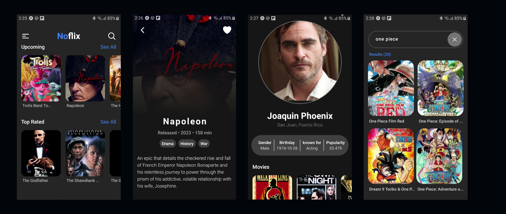

# Noflix App

## Description

Noflix is a mobile application built with React Native and Expo. The application is designed to provide users with a platform to discover and learn about various movies. Users can search for movies, view detailed information about each movie, and even see a list of trending, upcoming, and top-rated movies.

## Screenshots

## Try it now
Scan this QR code using [Expo Go](https://expo.dev/client)
 
 

## How to Develop Locally

To develop the Noflix application locally, you need to follow these steps:

1. Clone the repository to your local machine.
2. Install the project dependencies by running `bun install` in the terminal.
3. Navigate to the expo app project directory using `cd apps/expo-app`.
4. Start the development server by running `bun android` or `bun web`.
5. Use the Expo app on your mobile device to scan the QR code displayed in the terminal. This will open the application on your device.
6. If you are developing using the website version you can visit `localhost:5173`.

## Tech Stack

The Noflix application is built using the following technologies:

- **React Native**: A framework for building native apps using React and JavaScript. It's used for building the user interface of the application.
- **Expo**: A platform for making universal native apps for Android, iOS, and the web with JavaScript and React. It's used for setting up the development environment and building the application.
- **React Query**: A data synchronization library for React that enables you to fetch, cache, and update data in your React applications. It's used for fetching and managing the application's state.
- **Tailwind CSS**: A utility-first CSS framework for rapidly building custom designs. It's used for styling the application. In this project, Tailwind CSS is used via the [twrnc](https://www.npmjs.com/package/twrnc) package, which provides a set of utilities for using Tailwind CSS with React Native.
- **React Navigation**: A library for routing and navigation in React Native apps. It's used for managing the navigation between different screens in the application.

## Scripts

- `"android:tunnel": "expo start --tunnel"`: This command starts the Expo development server in tunnel mode, which allows the application to be accessed over the internet. This is useful for testing the application on a device that is not on the same local network as the development machine.
- `"android": "expo start --android"`: This command starts the Expo development server and opens the application on an Android device or emulator.
- `"ios": "expo start --ios"`: This command starts the Expo development server and opens the application on an iOS device or simulator.
- `"web": "bun vite"`: This command starts the Vite development server, which is used for serving the web application.